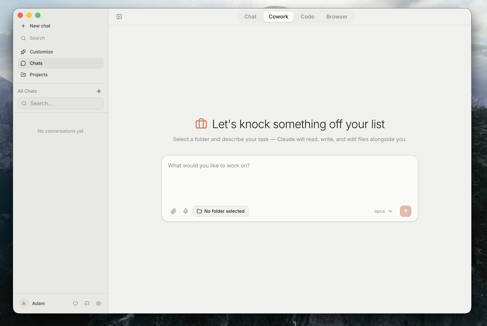

# Quarry

A desktop AI workspace for nib teams. Select your team, start working.



## Download

| Platform | Download |
|----------|----------|
| Mac (Apple Silicon) | [Quarry-arm64.dmg](https://github.com/redacted-org/quarry/releases/latest) |
| Mac (Intel) | [Quarry.dmg](https://github.com/redacted-org/quarry/releases/latest) |
| Windows | [Quarry-Setup.exe](https://github.com/redacted-org/quarry/releases/latest) |

Auto-updates are built in. Once installed, new versions are downloaded and applied automatically.

## What it does

Quarry gives every nib team member an AI coding assistant that runs locally on their machine. It connects to Claude via your team's API key (configured automatically when you select your team during onboarding).

### Surfaces

- **Chat** — conversational AI with file attachments and web search
- **Cowork** — full agent workspace with folder picker, tool visualization (Context + Artifacts panels), and project management
- **Code** — code-focused surface for development tasks
- **Browser** — built-in browser for research and testing

### Connectors

Connect your work apps via OAuth (one-click setup during onboarding or in Customize):

- GitHub (repos, PRs, issues)
- Slack (channels, messages)
- Jira (projects, tickets, boards)
- Confluence (spaces, pages, docs)
- Figma (design files)

Connected apps are exposed to Claude as MCP tools, allowing it to read issues, post messages, review PRs, and more.

### Document processing

Attach files directly to any conversation. Documents are extracted server-side before reaching the model:

| Format | Extensions | How it works |
|--------|-----------|--------------|
| PDF | `.pdf` | Page-by-page text extraction via pdfjs-dist |
| Word | `.docx` | Text extraction via mammoth |
| Excel | `.xlsx`, `.xls` | Sheets converted to markdown tables via SheetJS |
| PowerPoint | `.pptx` | Slide text + notes extracted via jszip |
| Audio | `.mp3`, `.wav`, `.m4a`, `.ogg` | Whisper transcription (@huggingface/transformers) |
| Video | `.mp4`, `.mov`, `.webm`, `.avi` | ffmpeg audio extraction then Whisper transcription |
| Images | `image/*` | Passed through (placeholder in text-only mode) |
| Text/Code | `.txt`, `.md`, `.csv`, `.json`, etc. | Inlined directly |

**Cowork/Code surfaces**: extracted text is saved to `~/.quarry/scratch/{chatId}/documents/` and the agent uses Read/Grep tools to navigate it. No size truncation.

**Chat surface**: first ~30k characters are inlined into the prompt with `<document>` tags.

**Large files** (>10MB): uploaded via `POST /api/upload` as multipart instead of base64 in the JSON body.

**Excel tools**: the agent can read, create, and edit Excel files using ExcelRead, ExcelWrite, and ExcelEdit MCP tools (available on Cowork and Code surfaces).

### Other features

- **Model selection** — switch between Claude Opus, Sonnet, and Haiku
- **Voice input** — local speech-to-text via Whisper
- **Agent routing** — AGENTS.md-based routing with custom tool profiles
- **Memory** — automatic context extraction across conversations
- **Project management** — organize work across multiple codebases
- **Conversation history** — searchable chat history with daily grouping

## Development

```bash
cd web
cp .env.example .env    # Add OAuth client credentials
npm install
npm run electron:dev
```

No test suite or linter is configured.

### Environment variables

Copy `.env.example` to `.env` and fill in the OAuth credentials for the connectors you want to enable. The `ANTHROPIC_API_KEY` is provided automatically via team selection (stored in `src/config/teams.json`).

### Architecture

Electron + Next.js app. All source code is in `web/`.

```
web/
  main-web.js                     # Electron main process
  preload-web.js                  # IPC bridge
  src/
    app/api/                      # Next.js API routes (SSE streaming, connectors, settings)
    components/
      surfaces/                   # Chat, Cowork, Code, Browser
      shared/                     # Message list, input, tool cards
      settings/                   # Settings dialog + sections
      customize/                  # Connectors, automations
      layout/                     # Sidebar, tabbar, app shell
    stores/                       # Zustand stores (chat, cowork, conversation, settings, app)
    hooks/                        # React hooks (SSE stream, electron, voice, heartbeat)
    lib/
      providers/                  # AI provider adapters (Claude, Gateway)
      connectors/                 # OAuth registry + provisioner
      surfaces/                   # Surface configs + allowed tools
```

### Building

Releases are built via GitHub Actions on tag push:

```bash
git tag v0.5.0
git push origin v0.5.0
# GitHub Actions builds Mac (signed + notarized) + Windows
# Artifacts published to GitHub Releases
```

The build pipeline is defined in `.github/workflows/release.yml`.

## Tech stack

| Layer | Technology |
|-------|------------|
| Desktop | Electron 41 |
| UI | Next.js 16 + React 19 + shadcn/ui |
| AI | Claude Agent SDK |
| Connectors | MCP (Model Context Protocol) |
| Streaming | Server-Sent Events |
| State | Zustand |
